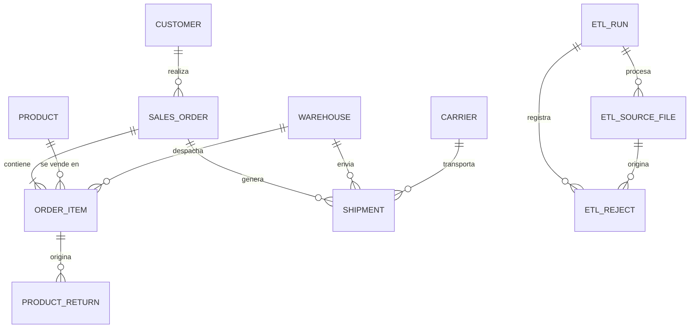

# 3. Diseño de la base de datos

**Estado:** implementado en `core/models.py` (migración `core/migrations/0001_initial.py` aplicada en la base de desarrollo).

## Capas

`staging` (datos crudos tal como llegan) → `core` (datos limpios y normalizados) → vistas materializadas de `analytics` (KPIs).

## Diagrama ER

## Nombres lógicos y nombres de tabla

Este documento usa nombres lógicos (`sales_order`, `product_return`). En PostgreSQL, Django crea las tablas con el prefijo de la app: `core_customer`, `core_product`, `core_warehouse`, `core_carrier`, `core_salesorder`, `core_orderitem`, `core_shipment`, `core_productreturn`. Las consultas SQL, las vistas materializadas y el ETL deben usar los nombres reales.

## Tablas core

### customer

| Campo | Tipo | Notas |
|---|---|---|
| id | bigint PK | |
| external_id | varchar(50) | único |
| name | varchar(100) | |
| email | varchar(100) | nulo permitido, sin unicidad |
| region | varchar(100) | |
| comuna | varchar(100) | |
| created_at | timestamptz | `default=now`, no `auto_now_add`: el ETL carga fechas históricas |

### product

| Campo | Tipo | Notas |
|---|---|---|
| id | bigint PK | |
| sku | varchar(40) | único, normalizado (mayúsculas, sin espacios) |
| name | varchar(100) | |
| category | varchar(80) | |
| unit_cost | bigint | CLP, >= 0 |
| unit_price | bigint | CLP, >= 0 |
| active | boolean | por defecto true |

### warehouse

| Campo | Tipo | Notas |
|---|---|---|
| id | bigint PK | |
| code | varchar(20) | único |
| name | varchar(100) | |
| region | varchar(100) | |

### carrier

| Campo | Tipo | Notas |
|---|---|---|
| id | bigint PK | |
| name | varchar(100) | único |

### sales_order

| Campo | Tipo | Notas |
|---|---|---|
| id | bigint PK | |
| external_id | varchar(50) | único, clave de upsert |
| customer_id | FK customer | `PROTECT` |
| status | varchar(20) | `pending, paid, shipped, delivered, cancelled` (choices en Django) |
| created_at | timestamptz | `default=now`, con índice |
| paid_at | timestamptz | nulo permitido |
| destination_region | varchar(100) | |

### order_item

| Campo | Tipo | Notas |
|---|---|---|
| id | bigint PK | |
| external_id | varchar(60) | único, clave de upsert (por ejemplo `ORD-1001-L1`) |
| order_id | FK sales_order | `PROTECT` |
| product_id | FK product | `PROTECT` |
| warehouse_id | FK warehouse | `PROTECT`; bodega desde la que se despacha |
| quantity | int | > 0 (constraint `order_item_quantity_gt_0`) |
| unit_price | bigint | **snapshot** al momento de la venta, CLP |
| unit_cost | bigint | **snapshot** al momento de la venta, CLP |

### shipment

| Campo | Tipo | Notas |
|---|---|---|
| id | bigint PK | |
| order_id | FK sales_order | `PROTECT` |
| warehouse_id | FK warehouse | `PROTECT` |
| carrier_id | FK carrier | `PROTECT` |
| shipped_at | timestamptz | nulo permitido |
| promised_at | timestamptz | |
| delivered_at | timestamptz | nulo permitido, con índice |
| status | varchar(20) | `pending, shipped, delivered, cancelled` (choices en Django) |

Restricciones: único `(order_id, warehouse_id)` (`shipment_unique_order_warehouse`); `delivered_at >= shipped_at` cuando ambos existen (`shipment_delivered_after_shipped`).

### product_return

| Campo | Tipo | Notas |
|---|---|---|
| id | bigint PK | |
| external_id | varchar(50) | único, clave de upsert |
| order_item_id | FK order_item | `PROTECT` |
| quantity | int | > 0 (constraint `product_return_quantity_gt_0`) |
| reason | varchar(50) | texto; el ETL lo normaliza a un catálogo de motivos |
| refund_amount | bigint | CLP, >= 0 |
| created_at | timestamptz | `default=now` |

## Tablas de control del ETL

Se implementan en la app `etl`.

### etl_run

| Campo | Tipo | Notas |
|---|---|---|
| id | bigint PK | |
| started_at | timestamptz | |
| finished_at | timestamptz | nulo mientras corre |
| status | enum | `running, success, warnings, failed` |
| rows_read, rows_loaded, rows_corrected, rows_rejected | int | |

### etl_source_file

| Campo | Tipo | Notas |
|---|---|---|
| id | bigint PK | |
| run_id | FK etl_run | |
| filename | varchar | |
| file_hash | char(64) | garantiza idempotencia (ver pendientes: cómo evitar que un run fallido bloquee el reintento) |
| entity | varchar(30) | |
| rows | int | |

### etl_reject

| Campo | Tipo | Notas |
|---|---|---|
| id | bigint PK | |
| run_id | FK etl_run | |
| source_file_id | FK etl_source_file | |
| entity | varchar(30) | |
| row_number | int | |
| rule_code | varchar(30) | ver [Pipeline ETL](05-pipeline-etl.md) |
| reason | text | |
| raw_data | jsonb | fila original |

### Staging

Tablas `stg_<entidad>` con todas las columnas como `text`, más `source_file_id` y `row_number`. Se crean con `RunSQL` en una migración y se cargan con Pandas o `COPY`, no con el ORM.

## Decisiones de diseño

- **Precio y costo viven en `order_item`** (snapshot). Si solo estuvieran en `product`, el margen histórico cambiaría cada vez que se actualiza un precio.
- **Montos en CLP como enteros** (`bigint`, `PositiveBigIntegerField` en Django), sin decimales, para evitar errores de redondeo.
- **Fechas con zona horaria:** se guardan en UTC y se muestran en America/Santiago (`USE_TZ = True`, `TIME_ZONE = "America/Santiago"`). Las agrupaciones por día en los KPIs se hacen con `AT TIME ZONE 'America/Santiago'`.
- **`created_at` con `default=timezone.now`** y no `auto_now_add`, porque este último ignora el valor entregado y el ETL perdería las fechas históricas.
- **Un despacho por par pedido-bodega.** Un pedido con productos de dos bodegas genera dos `shipment`; por eso `order_item` lleva `warehouse_id`.
- **`external_id` único** en clientes, pedidos, ítems de pedido y devoluciones, para que el ETL haga upsert y sea idempotente. En `order_item` y `product_return` lo genera el generador de datos sintéticos.
- **Claves foráneas con `PROTECT`:** no se borran en cascada pedidos, ítems ni despachos.
- **Estados como enumeraciones fijas** implementadas como `CharField` con `choices` (`TextChoices`), no como enum nativo de PostgreSQL. El mapeo de variantes textuales se hace en el ETL.
- **Constraints en la base de datos,** no solo en Django: cantidad > 0, precio >= 0, `delivered_at >= shipped_at`.
- **Nombres lógicos `sales_order` y `product_return`** en lugar de `order` y `return`, que son palabras reservadas de SQL y obligan a usar comillas en las queries de KPIs.
- **Índices** en `sales_order.created_at`, `shipment.delivered_at` y claves foráneas (Django las indexa automáticamente).
- **Sin `ordering` en Meta** en las tablas grandes, para no agregar un `ORDER BY` a cada consulta.
- **Esquemas:** las tablas `core` viven en el esquema por defecto vía ORM; `staging` y las vistas materializadas de `analytics` se crean con `RunSQL` y se leen con modelos `managed = False`.
- **Fuera del MVP pero previsto:** tabla `stock_snapshot`, para que agregarla no rompa nada.

## Pendiente

- [x] Validar este diagrama antes de crear la primera migración.
- [x] Decidir si `unit_price` incluye IVA o es neto, y si el margen considera descuentos y costo de envío (el modelo actual no los tiene).
- [ ] Definir la regla de estado entre `sales_order.status` y `shipment.status` (derivar uno del otro o validar coherencia en el ETL).
- [ ] `etl_source_file.file_hash`: evitar que un run fallido bloquee el reintento (crear el registro en la misma transacción de la carga o aplicar el único solo a archivos cargados con éxito).
- [ ] Reglas de validación entre filas en el ETL: suma de devoluciones por ítem <= cantidad vendida; un despacho por cada bodega presente en las líneas del pedido.
- [ ] Normalizar `region` y `comuna` en el ETL (variantes de texto).

Anterior: [Alcance del MVP](02-alcance-mvp.md) | Siguiente: [Fuente de datos](04-fuente-de-datos.md)