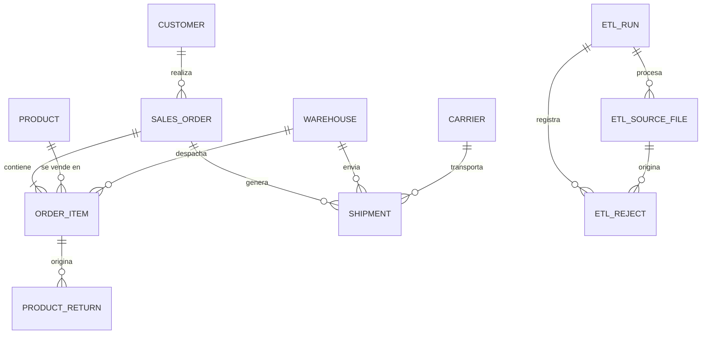

# 3. Diseño de la base de datos

## Capas

`staging` (datos crudos tal como llegan) → `core` (datos limpios y normalizados) → vistas materializadas de `analytics` (KPIs).

## Diagrama ER

## Tablas core

### customer

| Campo | Tipo | Notas |
|---|---|---|
| id | bigint PK | |
| external_id | varchar(50) | único |
| name | varchar | |
| email | varchar | nulo permitido |
| region | varchar | |
| comuna | varchar | |
| created_at | timestamptz | |

### product

| Campo | Tipo | Notas |
|---|---|---|
| id | bigint PK | |
| sku | varchar(40) | único, normalizado (mayúsculas, sin espacios) |
| name | varchar | |
| category | varchar(80) | |
| unit_cost | bigint | CLP, >= 0 |
| unit_price | bigint | CLP, >= 0 |
| active | boolean | por defecto true |

### warehouse

| Campo | Tipo | Notas |
|---|---|---|
| id | bigint PK | |
| code | varchar(20) | único |
| name | varchar | |
| region | varchar | |

### carrier

| Campo | Tipo | Notas |
|---|---|---|
| id | bigint PK | |
| name | varchar | único |

### sales_order

| Campo | Tipo | Notas |
|---|---|---|
| id | bigint PK | |
| external_id | varchar(50) | único, clave de upsert |
| customer_id | FK customer | |
| status | enum | `pending, paid, shipped, delivered, cancelled` |
| created_at | timestamptz | |
| paid_at | timestamptz | nulo permitido |
| destination_region | varchar | |

### order_item

| Campo | Tipo | Notas |
|---|---|---|
| id | bigint PK | |
| order_id | FK sales_order | |
| product_id | FK product | |
| warehouse_id | FK warehouse | bodega desde la que se despacha |
| quantity | int | > 0 |
| unit_price | bigint | **snapshot** al momento de la venta |
| unit_cost | bigint | **snapshot** al momento de la venta |

### shipment

| Campo | Tipo | Notas |
|---|---|---|
| id | bigint PK | |
| order_id | FK sales_order | |
| warehouse_id | FK warehouse | |
| carrier_id | FK carrier | |
| shipped_at | timestamptz | nulo permitido |
| promised_at | timestamptz | |
| delivered_at | timestamptz | nulo permitido |
| status | enum | |

Restricciones: único `(order_id, warehouse_id)`; `delivered_at >= shipped_at`.

### product_return

| Campo | Tipo | Notas |
|---|---|---|
| id | bigint PK | |
| order_item_id | FK order_item | |
| quantity | int | > 0 |
| reason | varchar(50) | catálogo de motivos |
| refund_amount | bigint | CLP, >= 0 |
| created_at | timestamptz | |

## Tablas de control del ETL

### etl_run

| Campo | Tipo | Notas |
|---|---|---|
| id | bigint PK | |
| started_at | timestamptz | |
| finished_at | timestamptz | nulo mientras corre |
| status | enum | `running, success, warnings, failed` |
| rows_read, rows_loaded, rows_corrected, rows_rejected | int | |

### etl_source_file

| Campo | Tipo | Notas |
|---|---|---|
| id | bigint PK | |
| run_id | FK etl_run | |
| filename | varchar | |
| file_hash | char(64) | único, garantiza idempotencia |
| entity | varchar(30) | |
| rows | int | |

### etl_reject

| Campo | Tipo | Notas |
|---|---|---|
| id | bigint PK | |
| run_id | FK etl_run | |
| source_file_id | FK etl_source_file | |
| entity | varchar(30) | |
| row_number | int | |
| rule_code | varchar(30) | ver [Pipeline ETL](05-pipeline-etl.md) |
| reason | text | |
| raw_data | jsonb | fila original |

### Staging

Tablas `stg_<entidad>` con todas las columnas como `text`, más `source_file_id` y `row_number`.

## Decisiones de diseño

- **Precio y costo viven en `order_item`** (snapshot). Si solo estuvieran en `product`, el margen histórico cambiaría cada vez que se actualiza un precio.
- **Montos en CLP como enteros** (`bigint`), sin decimales, para evitar errores de redondeo.
- **Fechas con zona horaria:** se guardan en UTC y se muestran en America/Santiago.
- **Un despacho por par pedido-bodega.** Un pedido con productos de dos bodegas genera dos `shipment`; por eso `order_item` lleva `warehouse_id`.
- **`external_id` único** en pedidos y clientes, para que el ETL haga upsert y sea idempotente.
- **Estados como enumeraciones fijas;** el mapeo de variantes textuales se hace en el ETL.
- **Constraints en la base de datos,** no solo en Django: cantidad > 0, precio >= 0, `delivered_at >= shipped_at`.
- **Nombres `sales_order` y `product_return`** en lugar de `order` y `return`, que son palabras reservadas de SQL y obligan a usar comillas en las queries de KPIs.
- **Índices** en `sales_order.created_at`, `shipment.delivered_at` y claves foráneas de uso frecuente.
- **Fuera del MVP pero previsto:** tabla `stock_snapshot`, para que agregarla no rompa nada.

## Pendiente

- [ ] Validar este diagrama antes de crear la primera migración.

Anterior: [Alcance del MVP](02-alcance-mvp.md) | Siguiente: [Fuente de datos](04-fuente-de-datos.md)
