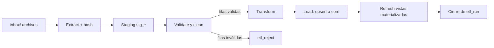

# 5. Pipeline ETL

## Flujo

## Etapas

1. **Extract:** lee archivos desde `inbox/`. Calcula el hash de cada archivo; si ya fue procesado, lo omite (idempotencia). Registra el archivo en `etl_source_file`.
2. **Staging:** carga todo como texto a tablas `stg_*`, sin transformar. Permite reprocesar siempre.
3. **Validate y clean (Pandas):** aplica las reglas de la tabla siguiente.
4. **Transform:** normaliza tipos, mapea estados, convierte zonas horarias y calcula campos derivados (por ejemplo `promised_at`).
5. **Load:** upsert a `core` en orden de dependencias, dentro de una transacción por entidad: `warehouse, carrier, product, customer → sales_order → order_item → shipment → product_return`.
6. **Post-load:** refresca las vistas materializadas.
7. **Log:** cierra el `etl_run` con conteos y estado.

## Reglas de validación

| Código | Regla | Acción |
|---|---|---|
| `DUP_ORDER` | `order_id` repetido | Corregir: conservar el último |
| `SKU_FMT` | SKU con espacios o minúsculas | Corregir: normalizar |
| `SKU_UNKNOWN` | SKU no existe en el maestro | Rechazar |
| `STATUS_MAP` | Estado con variantes ("ENTREGADO", "Entregado ") | Corregir: mapear |
| `DATE_FMT` | Fecha en formato mixto | Corregir: parsear |
| `DATE_ORDER` | `delivered_at < shipped_at` | Rechazar |
| `AMOUNT_NEG` | Monto o cantidad <= 0 | Rechazar |
| `CUST_EMAIL_NULL` | Cliente sin email | Advertencia: cargar igual |

La lista crece a medida que el generador agrega tipos de error. Cada regla debe tener un test.

## Reglas de operación

- Una fila rechazada no detiene la corrida: se guarda en `etl_reject` con su motivo y el dato original.
- Si el rechazo supera un umbral (por ejemplo 10% de un archivo), la corrida queda marcada como "con advertencias".
- Reejecutar el mismo archivo no duplica datos.
- **División de trabajo:** la limpieza va en Pandas; las agregaciones y los KPIs van en SQL. Justificar esta decisión en el README.
- Ejecución con `python manage.py run_etl`. Celery queda para v2.

## Pendiente

- [ ] Fijar el umbral de rechazo que marca una corrida con advertencias.
- [ ] Definir el catálogo de motivos de devolución.

Anterior: [Fuente de datos](04-fuente-de-datos.md) | Siguiente: [KPIs](06-kpis.md)
